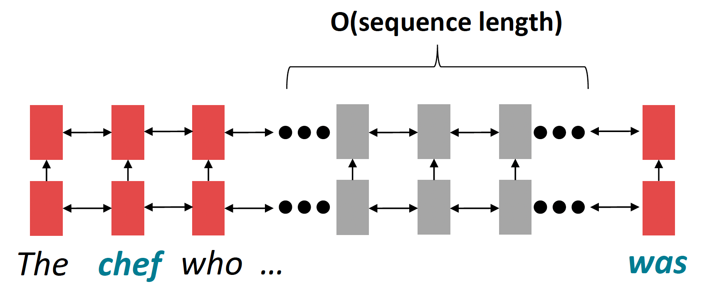
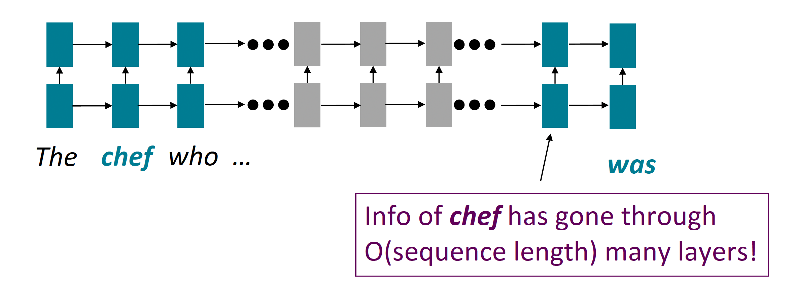
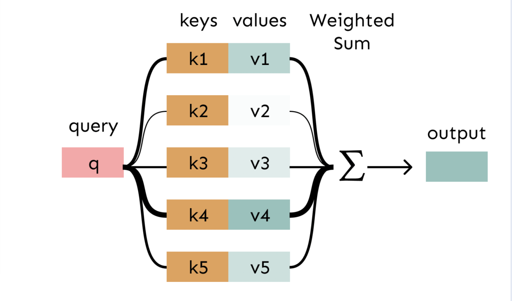
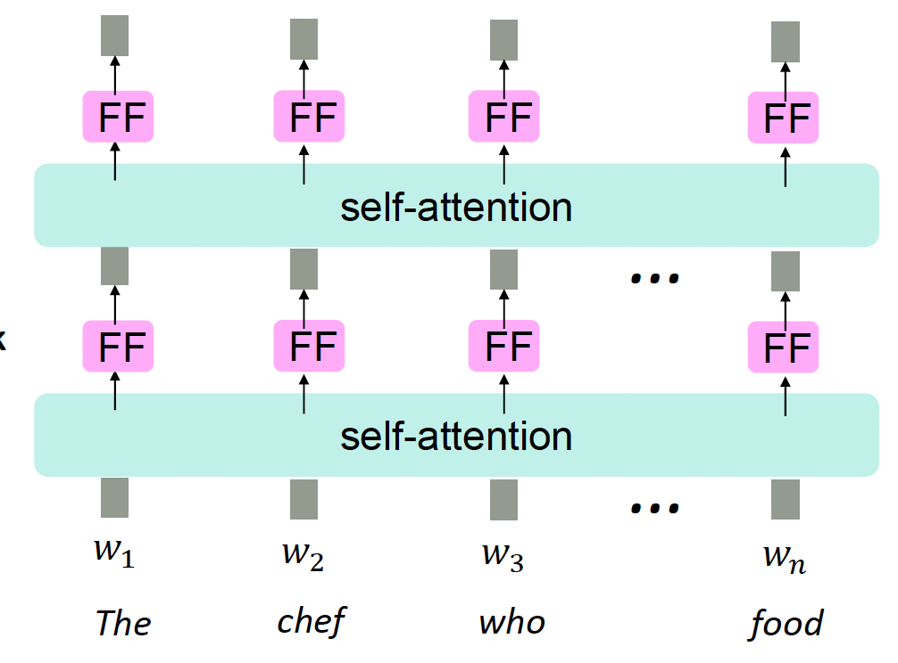
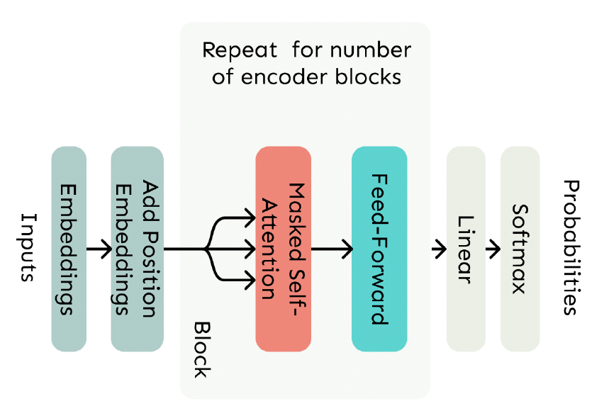
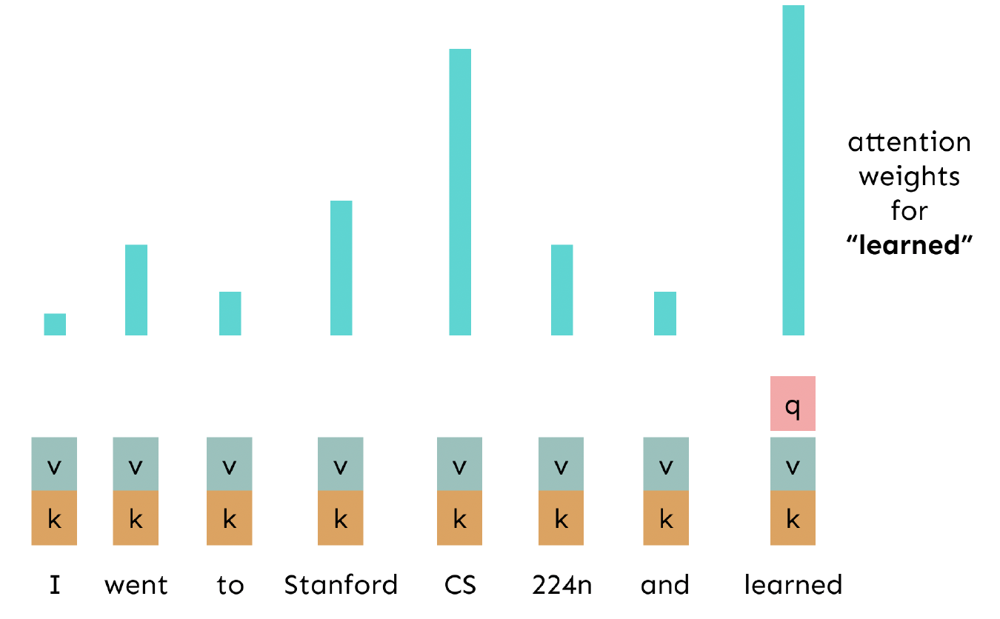
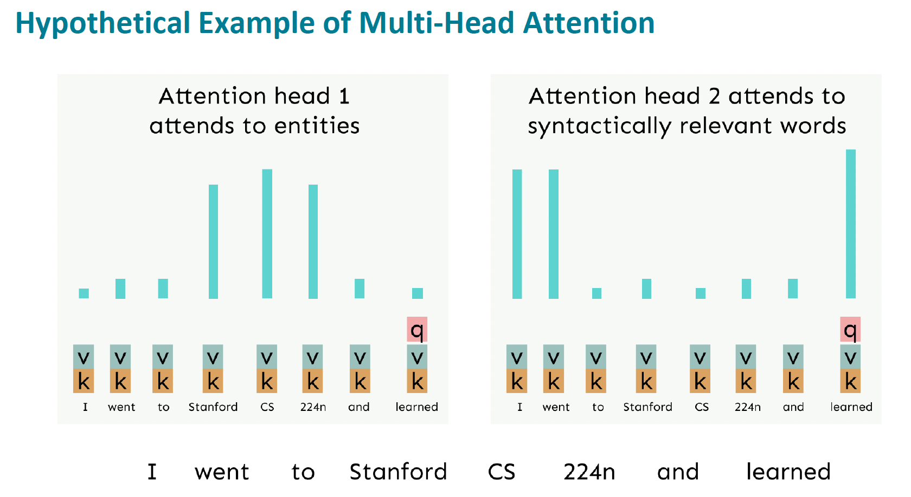
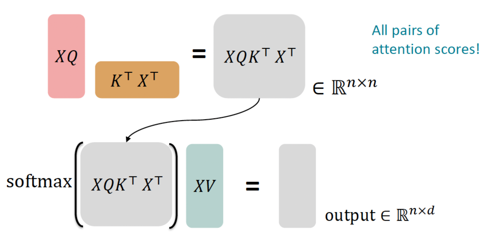
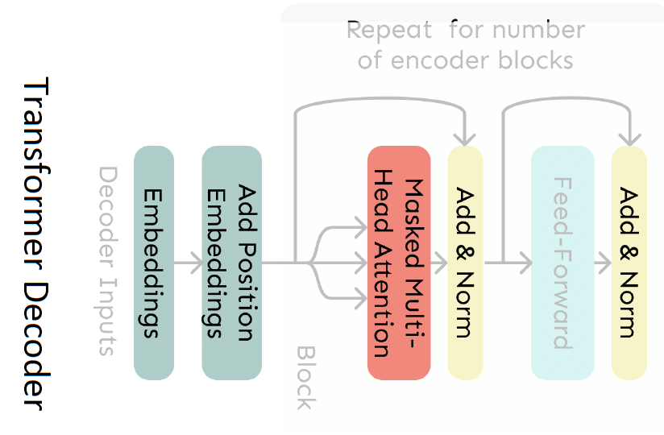

+++
author = "Laychiva Chhout"
title = "RNN to Transformer"
date = "2023-12-28"
description = "From RNN to Transformer models."
math = "true"
tags = [
    "ai",
    "dl",
]
categories = [
    "Artificial Intelligence",
    "Deep Learning",
]
series = ["Themes Guide"]
aliases = ["migrate-from-jekyl"]
image = "cover.png"
+++

## 1. Issue with Recurrent Model

### 1.1. Linear Interaction

Recaps from the last blogpost on RNN:

- RNNs are unrolled "left-to-right".
- This encodes linear locality(nearby words often affect each other's meanings): a useful heuristic!

**Problem:** RNNs take O(sequence length) steps for distant word pairs to interact.

- O(sequence length) steps for distant word pairs to interact means:
	- Hard to learn long-distance dependencies (because gradient problems!)
	- Linear order of words is "baked in"; we already know linear order isn't the right way to think about sentences...

### 1.2. Lack of parallelizability

- Forward and backward passes have $O$(sequence length) unparallelizable operations
 	- GPUs can perform a bunch of independent computations at once!
 	- But future RNN hidden states can't be computed in full before past RNN hidden states have been computed
 	- Inhibits training on very large datasets!
 	

### 1.3. If not recurrent, then what? How about Attention?

- Attention treats each word's representation as a query to access and incorporate information from a set of values.
- Number of unparallelizable operations does not increase with sequence length.
- Maximum interaction distance: $\mathrm{O}(1)$, since all words interact at every layer!
 

## 2. Attention as a soft

In attention, the **query** matches all **keys** softly, to a weight between 0 and 1. The keys' values are multiplied by the weighted and summed.

## 3. Self-attention: keys, queries, values FROM THE SAME SEQUENCE!

Let ${w}_{1: n}$ be a sequence of words in vocabulary $V$, like **Zuko made his uncle tea.**
For each $w_i$, let $x_i=Ew_i$, where $E \in \mathbb{R}^{d \times|V|}$ is an embedding matrix.
1. Transform each word embedding with weight matrices $\mathrm{Q}, \mathrm{K}, \mathrm{V}$, each in $\mathbb{R}^\{d \times d\}$

$$
q_i = Q x_i \text{ (queries)} \quad k_i = K x_i \text{ (keys)} \quad v_i = V x_i \text{ (values)}
$$

2. Compute pairwise similarities between keys and queries; normalize with softmax
$$
e_{ij} = q_i^{\top} k_j \quad \alpha_{ij} = \frac{\exp(e_{ij})}{\sum_{j'} \exp(e_{ij'})}
$$
3. Compute output for each word as weighted sum of values
$$
o_i=\sum_{j} \alpha_{i j} v_i
$$

**Note:** The main distinction between attention and self-attention lies in where the queries come from. In traditional attention models, the query is typically derived from an external state (like the decoder state in a sequence-to-sequence model), whereas in self-attention, the query is derived from the input sequence itself. 

*Another way to say it, the attention model allow the query to attends a particular part of the input whereas the self-attention allow the query to attends the entire input.*

Self-attention seems to be powerful and useful in many tasks, however there are some problems or limitation that we can't use self-attention directly.

### 3.1. First Limitation

Self-attention doesn't have an inherent notion of order, we need to encode the order of the sentence in our keys, queries and values.

- Since self-attention doesn't build in order information, we need to encode the order of the sentence in our keys, queries, and values.
- Consider representing each sequence index as a vector$$\boldsymbol{p}_i \in \mathbb{R}^d, \quad \text{for} \quad i \in\{1,2, \ldots, n\}$$ are position vectors
- Easy to incorporate this info into our self-attention block: just add the $\boldsymbol{p}_i$ to our inputs!
- Recall that $x_i$ is the embedding of the word at index $i$. The positioned embedding is:
$$
\tilde{\boldsymbol{x}}_i=\boldsymbol{x}_i+\boldsymbol{p}_i
$$
Remark:
In deep self-attention networks, we do this at the first layer (positional encoding), we could concatenate them as well, but people mostly just use addition.

#### 3.1.1. Position representation vectors through sinusoids

- Sinusoidal position representations: concatenate sinusoidal functions of varying periods:

- Pros:
	- Periodicity indicates that maybe "absolute position" isn't as important
	- Maybe can extrapolate to longer sequences as periods restart!
- Cons:
	- Not learnable; also the extrapolation doesn't really work!

**Learned absolute position representations**: Let all $p_i$ be learnable parameters!
Learn a matrix $\boldsymbol{p} \in \mathbb{R}^{d \times n}$, and let each $\boldsymbol{p}_i$ be a column of that matrix!
- Pros:
	- Flexibility: each position gets to be learned to fit the data
- Cons:
	- Definitely can't extrapolate to indices outside $1, \ldots, n$.
- **Most systems use this!**
- Sometimes people try more flexible representations of position:
	- Relative linear position attention [Shaw et al., 2018]
	- Dependency syntax-based position [Wang et al., 2019]

### 3.2. Second Limitation
Self-attention is just a weighted averages, there is no non-linearities for deep learning.

**Solution**: *add non-linearities in self-attention.*
- Note that there are no element wise non-linearities in self-attention; stacking more self-attention layers just re-averages value vectors, this is because the self-attention mechanism itself is a linear operation.
- Easy fix: add a feed-forward network to post-process each output vector.
$$
\begin{aligned}
m_i & =M L P\left(\text { output }_i\right) \\\
& =W_2 * \operatorname{ReLU}\left(W_1 \text { output }_i+b_1\right)+b_2
\end{aligned}
$$

**Intuition**: the FF network processes the result of attention (take attention output as an input).

### 3.3. Third Limitation
In self-attention, we have to ensure that we don't look at the future when predicting a sequence

- Like in machine translation
- Or language modeling

$\rightarrow$ **Solution:** masking the future in self-attention
- To use self-attention in decoders, we need to ensure we can't peek at the future.
- At every timestep, we could change the set of keys and queries to include only past words. (Inefficient!)
- To enable parallelization, we mask out attention to future words by setting attention scores to $-\infty$ 
$$
e_{i j} = q_i^{\top} k_j, j \leq i \quad \text{else} \quad 
e_{i j} = -\infty
$$

### 3.4. Recap

To recap, the necessities for a self-attention building block:
- Self-attention:
	- the basis of the method
- Position representation
	- Specify the sequence order, since self-attention is an unordered function of its inputs.
- Non-linearities:
	- At the output of the self-attention block
	- frequently implemented as a simple feed forward network
- Masking
	- In order to parallelize operations while not looking at the future
	- Keeps information about the future from "leaking" to the past.

## 4. The Transformer model

### 4.1. The Transformer Decoder

- A Transformer decoder is how we'll build systems like language model.
- It is a lot like our minimal self-attention architecture, but with a few more components.
- The embeddings and position embeddings are identical.
- We will next replace our self-attention with multi-head self-attention.

Basically, the Multi-Head Attention, is multiple self-attentions that attends to different kind of information, entities, relevant words, etc.

### 4.2. Sequence-Stacked form of Attention

- Let's look at how key-query-value attention is computed, in matrices.
	- Let $X=\left[x_1 ; \ldots ; x_n\right] \in \mathbb{R}^{n \times d}$ be the concatenation of input vectors.
	- First, note that $X K \in \mathbb{R}^{n \times d}, X Q \in \mathbb{R}^{n \times d}, X V \in \mathbb{R}^{n \times d}$.
	- The output is defined as output $=\operatorname{softmax}\left(X Q(X K)^{\top}\right) X V \in \mathbb{R}^{n \times d}$.

### 4.3. Multi-headed Attention

- What if we want to look in multiple places in the sentence at once?
	- For word $i$, self-attention "looks" where $x_i^{\top} Q^{\top} K x_j$ is high, but maybe we want to focus on different $j$ for different reasons?
- We'll define **multiple attention "heads"** through multiple $Q, K, V$ matrices
- Let, $Q_{\ell}, K_{\ell}, V_{\ell} \in \mathbb{R}^{d \times \frac{d}{h}}$, where $h$ is the number of attention heads, and $\ell$ ranges from 1 to $h$
- Each attention head performs attention independently:
	- $output_\ell=\operatorname{softmax}(X Q_\ell K_\ell^\top X^\top) * X V_\ell$, where output , $_{\ell} \in \mathbb{R}^{d / h}$
- Then the outputs of all the heads are combined!
	- output $=\left[\right.$ output $_1 ; \ldots ;$ output $\left._h\right] Y$, where $Y \in \mathbb{R}^{d \times d}$
- Each head gets to "look" at different things, and construct value vectors differently.

- Even though we compute $h$ many attention heads, it's not really more costly.
	- We compute $X Q \in \mathbb{R}^{n \times d}$, and then reshape to $\mathbb{R}^{n \times h \times d / h}$. (Likewise for $X K, X V$.)
	- Then we transpose to $\mathbb{R}^{h \times n \times d / h}$; now the head axis is like a batch axis.
	- Almost everything else is identical, and the **matrices are the same sizes.**

### 4.4. Scaled Dot Product [Vaswani et al., 2017]

Core Idea: **Scaled Dot Product** attention aids in training.
- When dimensionality $d$ becomes large, dot products between vectors tend to become large.
	- Because of this, inputs to the softmax function can be large, making the gradients small.
- Instead of the self-attention function we've seen:
$$
output_\ell=\operatorname{softmax}(X Q_\ell K_\ell^\top X^\top) * X V_\ell
$$
- We divide the attention scores by $\sqrt{d / h}$, to **stop the scores from becoming large** just as a function of $d / h$ (The dimensionality divided by the number of heads.)
$$
output_{\ell}=\operatorname{softmax}\left(\frac{X Q_{\ell} K_{\ell}^{\top} X^{\top}}{\sqrt{d / h}}\right) * X V_{\ell}
$$

- Now that we've replaced self-attention with multi-head self-attention, we'll go through two optimization tricks that end up being:
	- Residual Connections
	- Layer Normalization
- In most Transformer diagrams these are often written together as "Add \& Norm"

### 4.4.1. The Transformer Encoder: Residual connections [He et al., 2016]

- Instead of $X^{(i)}=\operatorname{Layer}\left(X^{(i-1)}\right)$ (where $i$ represents the layer)

- We let $X^{(i)}=X^{(i-1)}+\operatorname{Layer}\left(X^{(i-1)}\right)$ (so we only have to learn "the residual" from the previous layer)

**Notice**: Gradient is great through the residual connection; it's 1!

Intuitively, we can imagine training a very deep network like a long chain. When you make a change at the end of the chain, you want that change to be felt all the way back to the beginning. Normally, as you go back through the chain, the signal of that change gets weaker and weaker, which makes it hard for the early parts of the chain to learn. This is like trying to pass a whisper down a long line of people; by the time it reaches the end, it's often too soft to hear.

Residual connections are like shortcuts that let the change signal zip back to the start without getting weaker. They do this by keeping the signal strength at '1', meaning that the signal doesn't fade out as it goes back. This helps the whole network learn better because even the early parts can feel the changes clearly, just like if the message was passed directly to them without the long whispering line.

### 4.4.2. The Transformer Encoder: Layer normalization [Ba et al., 2016]

**Core idea:** Layer normalization is a trick to help models train faster.

- Idea: cut down on uninformative variation in hidden vector values by normalizing to unit mean and standard deviation within each layer.
- LayerNorm's success may be due to its normalizing gradients [Xu et al., 2019]

**Algorithm:**

- Let $x \in \mathbb{R}^d$ be an individual (word) vector in the model.
- Let $\mu=\sum_{j=1}^d x_j$; this is the mean; $\mu \in \mathbb{R}$.
- Let $\sigma=\sqrt{\frac{1}{d} \sum_{j=1}^d\left(x_j-\mu\right)^2}$; this is the standard deviation; $\sigma \in \mathbb{R}$.
- Let $\gamma \in \mathbb{R}^d$ and $\beta \in \mathbb{R}^d$ be learned "gain" and "bias" parameters. (Can omit!)
- Then layer normalization computes:
$$\text{output}=\frac{x-\mu}{\sqrt{\sigma}+\epsilon} * \gamma+\beta
$$

### 4.4.3. The Transformer Encoder-Decoder

#### 4.4.3.1. Decoder
The Transformer Decoder
- The Transformer Decoder is a stack of Transformer Decoder Blocks.
- Each Block consists of:
    - Self-attention (Masked in Decoder)
    - Add \& Norm
    - Feed-Forward
    - Add \& Norm
- That's it! We've gone through the Transformer Decoder.

#### 4.4.3.2. Encoder

The Transformer Decoder is designed to only look at past information, not the future, which is important for creating language models. But what if we need to consider information from both the past and future, like in some other types of networks? This is where the Transformer Encoder comes in. It's similar to the Decoder, but with one key difference: it doesn't block any future information. This means the Encoder can use both past and future information, making it capable of understanding context in both directions.

#### 4.4.3.3. The Cross-Attention (Output of Encoder-Input of Multi-Head Attention)

- We saw that self-attention is when keys, queries, and values come from the same source.
- In the decoder, we have attention that looks more like what we saw in the [previous blog](https://lchhout.github.io/blogs/post/attention/).
- Let $h_1, \ldots, h_n$ be output vectors from the Transformer encoder; $x_i \in \mathbb{R}^d$
- Let $z_1, \ldots, z_n$ be input vectors from the Transformer decoder, $z_i \in \mathbb{R}^d$
- Then keys and values are drawn from the encoder (like a memory):
$$
k_i=K h_i, v_i=V h_i \text {. }
$$
- And the queries are drawn from the decoder, $q_i=Q z_i$.

## 5. Reference

- Lecture slides of Professor: **Geoffroy Peeter, Télécom Paris.**
- Lecture slides of stanford university: https://web.stanford.edu/class/cs224n/slides/