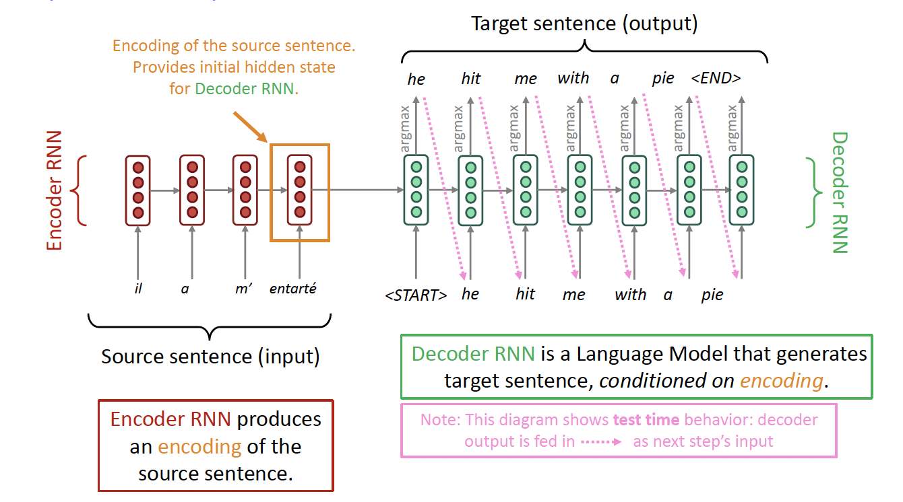

+++
author = "Laychiva Chhout"
title = "Sequence to Sequence Model"
date = "2023-12-28"
description = "Sequence to Sequence Model in Detail."
math = "true"
tags = [
    "ai",
    "ml",
    "dl",
]
categories = [
    "Artificial Intelligence",
    "Deep Learning",
]
series = ["Themes Guide"]
aliases = ["migrate-from-jekyl"]
image = "seqcover.png"
+++

## 1. Introduction

In the last blog post, we discussed Recurrent Neural Networks (RNNs) and Long Short-Term Memory (LSTM) networks, which are effective for sequential data processing. However, a challenge arises when dealing with sequences where the input and output lengths differ, in tasks like machine translation, text summarization, and question-answering systems. Traditional RNNs, including LSTMs, are designed for tasks where input and output sequences are aligned or of the same length. This alignment allows the network to process input and produce output at each time step in a synchronized manner. However, when the lengths vary, this one-to-one correspondence between the input and output sequence elements does not hold. 

To address this, the sequence-to-sequence (seq2seq) model was developed. The seq2seq model is an extension of the *encoder-decoder* architecture specifically tailored to handle sequences of different lengths.

In this blogpost, we will walk through the architecture of seq2seq model.

## 2. seq2seq [Sutskever et al., 2014]

The seq2seq model is an extension of the encoder-decoder architecture specifically designed to handle sequences of different lengths. In this model, the encoder processes the entire input sequence and compresses the information into a context vector. This context vector encapsulates the essence of the input sequence in a dense representation.
  

<!-- ![[../Photos/Screenshot 2023-10-05 at 10.17.00.png]] -->

seq2seq and encoder-decoder is similar, encoder-decoder uses architecture of seq2seq but it uses a context vector. The context vector is a weighted sum of the encoder's hidden states, and it is used to provide the decoder with information about the entire input sequence. This allows the decoder to generate more accurate and informative output sequences.

## 3. Application of seq2seq

### 3.1. Neural Machine Translation (NMT) (Standford Slides)

In this example, the general notion is an encoder-decoder model. If the input and output are sequences, we call it a seq2seq model. 

- One neural network (Encoder) takes input and produces a neural representation, and
- Another network (Decoder) produces output based on that neural representation

### 3.2. Another tasks in NLP that can be phrased as seq2seq

- **Summarization**: (long text $\rightarrow$ short text)

- **Dialogue**: (previous utterances $\rightarrow$ next utterance)

- **Parsing**: (input text $\rightarrow$ output parse as sequence)

- **Code generation**: (natural language $\rightarrow$ Python code)

## 4. Reference

- Lecture slides of Professor: **Geoffroy Peeter, Télécom Paris.**
- Lecture slides of stanford university: https://web.stanford.edu/class/cs224n/slides/